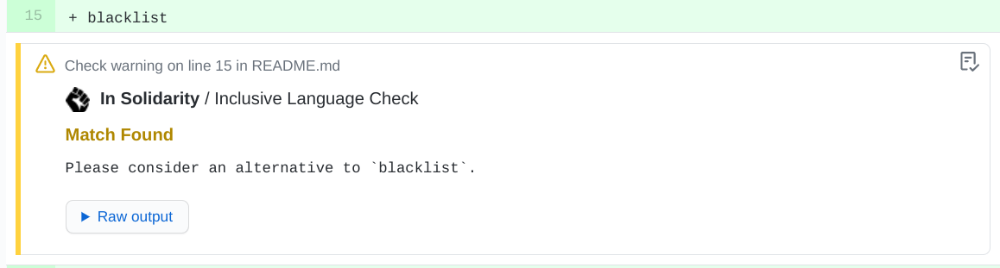

# In Solidarity

[](https://github.com/apps/in-solidarity)


[](https://codecov.io/gh/jpoehnelt/in-solidarity-bot)

[](https://github.com/semantic-release/semantic-release)
[](https://www.npmjs.com/package/in-solidarity-bot)
[](https://github.com/apps/in-solidarity)

> A GitHub Bot built with [Probot](https://github.com/probot/probot) that checks for inclusive language. See [our documentation](./docs/README.md) for more information.



## Install

The app can be installed at https://github.com/apps/in-solidarity.

> Note: The checks currently run on public repositories. This helps limit permissions for organizations with many repositories.

Share this app with one of the following badges.

```md
[](https://github.com/apps/in-solidarity)

[](https://github.com/apps/in-solidarity)

[](https://github.com/apps/in-solidarity)
```

[](https://github.com/apps/in-solidarity)

[](https://github.com/apps/in-solidarity)

[](https://github.com/apps/in-solidarity)

## Documentation

Rules and configuration options are at [./docs/README.md](https://github.com/jpoehnelt/in-solidarity-bot/blob/main/docs/README.md).

## Production

A [hosted version of this app](https://github.com/apps/in-solidarity) is available and a basic status page can be found at https://stats.uptimerobot.com/rX0A4iA75m.

## Development

```sh
# Install dependencies
npm install

# Run typescript
npm run build

# Test
npm test  # npm test -- -u to update snapshots
npm run lint  # npm run format to fix issues

# Set appropriate .env values and run the bot
npm start
```

## Contributing

> **Note**: Additional rules are welcome and can be added in [src/rules.ts](https://github.com/jpoehnelt/in-solidarity-bot/blob/main/src/rules.ts).

If you have suggestions for how the bot could be improved, or want to report a bug, open an issue! We'd love all and any contributions.

For more, check out the [Contributing Guide](CONTRIBUTING.md).

This is not an official Google product.
